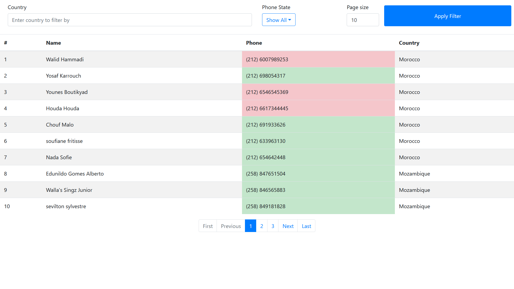
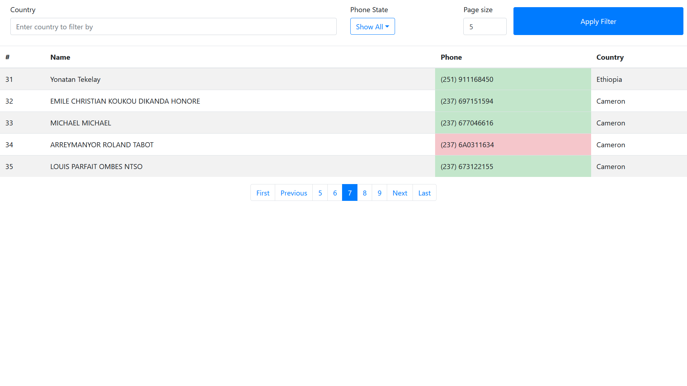
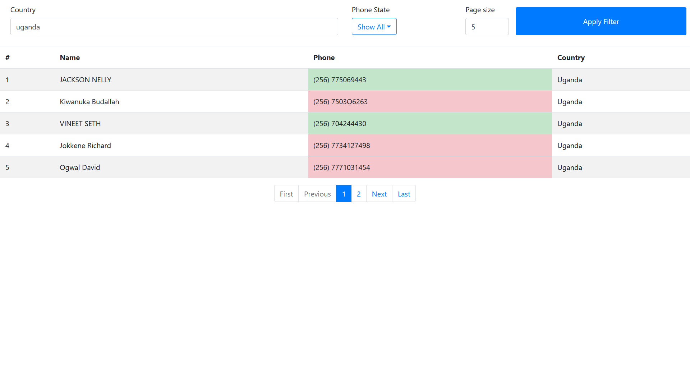
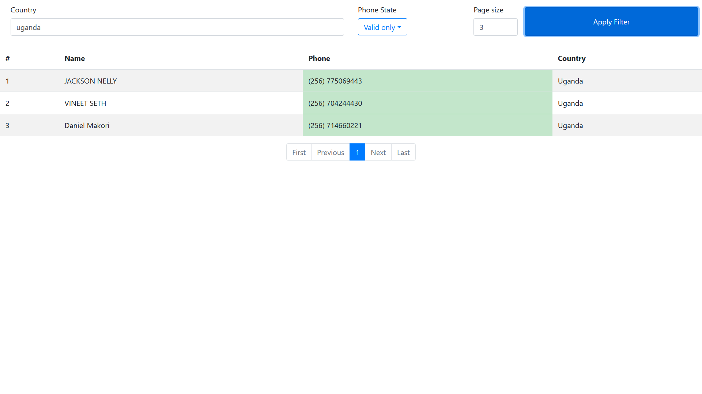
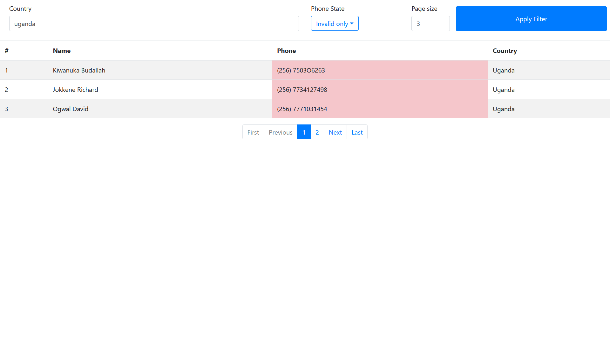

# PhoneNumberCategorizer

An app to categorized phone numbers by country 

Check both the [Backend](Backend/README.md) and the [Frontend](Frontend/README.md)

## Target platform
Any system with functioning web browser

## Credits 

I created this from scratch

## Run instructions
- install docker
- execute the command `docker-compose up --build --force-recreate` in root directory this will use docker to start the application with the backend at port 8888 and frontend at port 4200
- navigate to http://localhost:4200/ to explore the application through the frontend

### note: the above method requires the whole git repo to exist, if you just want to try out the application without needing the source then
- download/save this [docker-compose](StandaloneDocker/docker-compose.yml) file 
- run the command `docker-compose up --build --force-recreate` in the folder you saved the file in or run this [batch file](StandaloneDocker/startApplication.bat) (this will pull the images from docker hub directly)
- navigate to http://localhost:4200/ to explore the application using the frontend
## How to use the UI
  - write the country name to filter by or leave empty to get all then click apply filter
  - select the desired phone state from the drop down then click apply filter
  - change the page size by change it's input field then clicking apply filter
  - use the navigation bar at the bottom to navigate throw pages (note: doesn't show all pages at once)
  - page size auto shrinks to fit displayed content
  - the phone field's color represents it's state (green is valid, red is invalid)
  
  hint: you can fetch 0 size pages too, cause why not?

## Preview images

